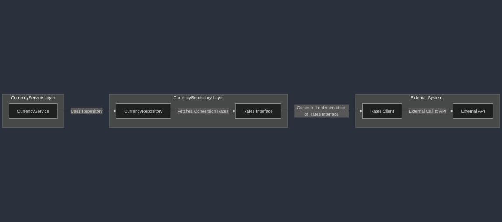

# go-transactions-api

## Introdução

O **go-transactions-api** é uma solução desenvolvida em Go que implementa um sistema de cobranças e processos financeiros com suporte a múltiplos gateways de pagamento e múltiplas moedas. O projeto utiliza uma arquitetura hexagonal, priorizando abstrações para desacoplar dependências específicas de implementação. Isso foi feito para possibilitar extensões dos gateways de pagamento de forma simples, usando o pattern strategy.

## Recursos

-   Suporte a múltiplos gateways de pagamento usando pattern stategy.
-   Conversão de moedas em tempo real usando APIs externas.
-   Cache de taxas de câmbio para melhorar a performance.
-   Testes unitários para os principais componentes.
    

## Tecnologias Utilizadas

-   **Linguagem**: Go
-   **Framework**: [Gin](https://github.com/gin-gonic/gin) para criação de APIs REST.
-   **Banco de Dados**: PostgreSQL, utilizando [lib/pq](https://github.com/lib/pq).
-   **Cache**: Redis, com [go-redis/v9](https://github.com/redis/go-redis).
-   **Gateway de Pagamento**: Integração com Stripe via [stripe-go](https://github.com/stripe/stripe-go).
-   **Conversão de Moedas**: APIs externas (ex.: OpenExchangeRates).
    

## Estrutura do Projeto

```
go-transactions-api/
|-- build/              # Configurações para ambiente virtualizado Docker
|-- cmd/                # Inicialização do sistema
|-- internal/           # Implementação dos casos de uso e lógica de negócios
|-- pkg/                # Pacotes compartilhados e utilitários
|-- mocks/              # Arquivos para testes mockados
|-- go.mod              # Gerenciamento de dependências
|-- environment.yaml    # Configurações do sistema
|-- Makefile            # Comandos para execução e testes
```

## Como Rodar

### Requisitos

-   Make (opcional para usar o Makefile).
    
-   Docker e Docker Compose.

### Execução

1.  Suba os serviços com Docker Compose:
    
    ```
    make up
    ```
    ou rode diretamente:
	```
    docker compose -f build/docker-compose.yaml up -d
    ```
    
2.  A API estará disponível em `http://localhost:8080`.
    

### Derrubar os Serviços

```
make down
```
ou
```
docker compose -f build/docker-compose.yaml down
```

## Testes

Para executar os testes unitários:

```
make tests
```
ou
```
docker compose -f build/docker-compose.yaml up -d > /dev/null 2>&1 &&
docker exec -it transactions-api go test -v -timeout 30s ./...
```

## Endpoints da API

### Criar um Pagamento

**POST**  `http://localhost:8080/payments`

```
{
    "gateway": "stripe",
    "amount": 1256,
    "currency": "EUR",
    "payment_method": "credit_card",
    "card_details": {
        "number": "4242424242424242",
        "expiry": "12/25",
        "cvv": "123"
    }
}
```
Response:
```
{
	"status":  "success",
	"message":  "Payment processed successfully. Payment ID: pi_3Qj0qM2Mrf6HX29B0XRct6lC"
}
```

### Consultar um Pagamento

**GET**  `http://localhost:8080/payments/{payment_id}`

Response:
```
{
	"id":  "pi_3Qj0qM2Mrf6HX29B0XRct6lC",
	"status":  "succeeded",
	"payment_base_currency":  "EUR",
	"payment_base_amount":  1256,
	"gateway":  "stripe",
	"gateway_transactionated_currency":  "USD",
	"gateway_transactionated_amount":  1291.60436595,
	"currency_conversion_rate":  0.972434,
	"creation_request_time":  "2025-01-18T20:56:34.930401Z"
}
```

### Converter Moedas

**POST**  `http://localhost:8080/currency/convert`

```
{
    "amount": 100.00,
    "from_currency": "USD",
    "to_currency": "RUB"
}
```
Response:
```
{
	"from_currency":  "USD",
	"to_currency":  "RUB",
	"original_amount":  100,
	"converted_amount":  10246.9562
}
```

O campo `from_currency` por uma limitação da API de conversão (Open Exchange) - [explicada aqui](#Limitacoes-e-Melhorias-Futuras) - só permite o valor USD com o plano free da chave configurada no projeto por padrão.

## Decisões de Design

-   **Arquitetura Hexagonal**: Escolhida para facilitar a extensão e manutenção do sistema, permitindo adicionar novos gateways de pagamento sem alterar a lógica central.
    
-   **Strategy Pattern**: Implementado para suportar diferentes provedores de pagamento com uma interface em comum.
    
-   **Uso de Ports e Adapters**: Garantindo abstrações claras entre camadas do sistema, sem que haja dependências em implementações concretas.

## Arquitetura da aplicação

Aqui estão os diagramas que ilustram a estrutura da aplicação:

### Diagrama 1: Estrutura Multigateway


### Diagrama 2: Estrutura Conversão de Moeda



## Limitações e Melhorias Futuras

-   **Cache no Repositório**: A lógica de cache está acoplada à camada de repositório, limitando a flexibilidade. Para resolver isso, seria interessante extrair a lógica de cache para um serviço dedicado, permitindo maior modularidade, reuso e facilidade de testes.
    
-   **Lógicas de Controle de Cache**: O controle do cache (ex.: TTL) está disperso no código, dificultando a manutenção. Centralizar essa lógica em um serviço ou componente dedicado tornaria o código mais limpo e gerenciável.
    
-   **Configurações no Repositório**: Atualmente, as configurações são acessadas diretamente no repositório para uso de configurações do cache, o que reduz a modularidade e dificulta extensões.

-   **Limitações PCI**: Devido aos **padrões de segurança PCI** (Payment Card Industry Data Security Standard), não é possível enviar os dados do cartão diretamente para a API da Stripe na implementação do gateway de pagamento utilizada neste projeto. Como resultado, o uso de um cartão de crédito para pagamento está sendo simulado por meio de um **mock**. Para mais detalhes sobre a conformidade PCI, consulte o [guia oficial da Stripe](https://stripe.com/br/guides/pci-compliance).

- **Limitações API's de conversão**: As APIs de conversão, como a Fixer e a Open Exchange Rates (utilizada neste projeto), possuem uma limitação importante: elas permitem a conversão apenas com base no dólar. Para ter acesso a outras moedas, é necessário um plano pago, o qual não está disponível no momento. Por conta disso, tanto o **endpoint de conversão** quanto a **moeda base** da aplicação estão configurados para o dólar. No entanto, essas configurações são flexíveis. Se você substituir a chave da API da Open Exchange Rates por uma chave de um plano pago, será possível realizar conversões para outras moedas.
        
----------
